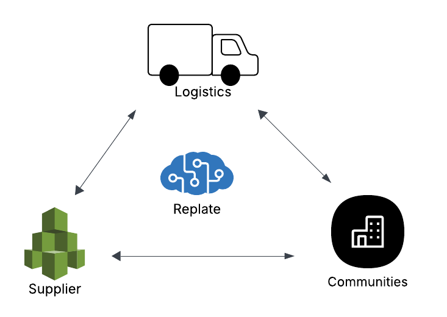
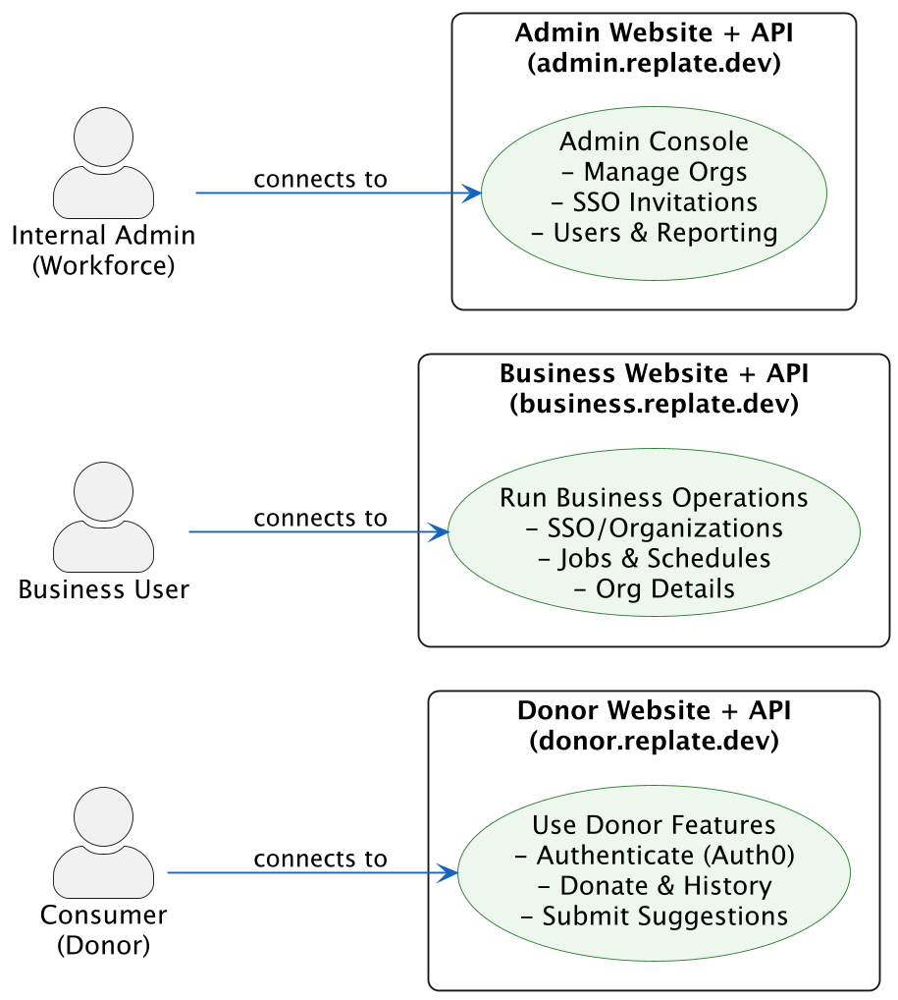
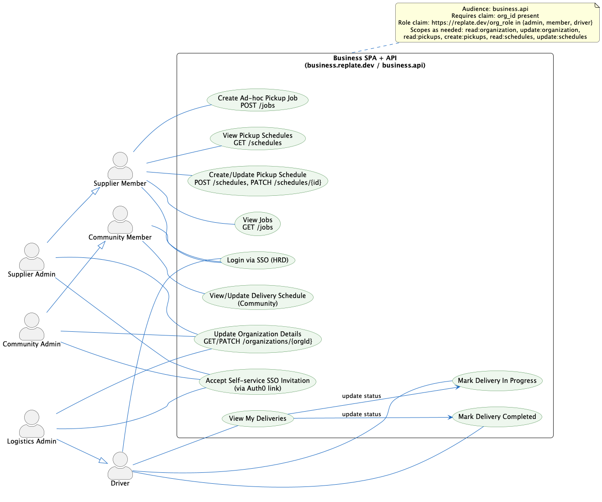
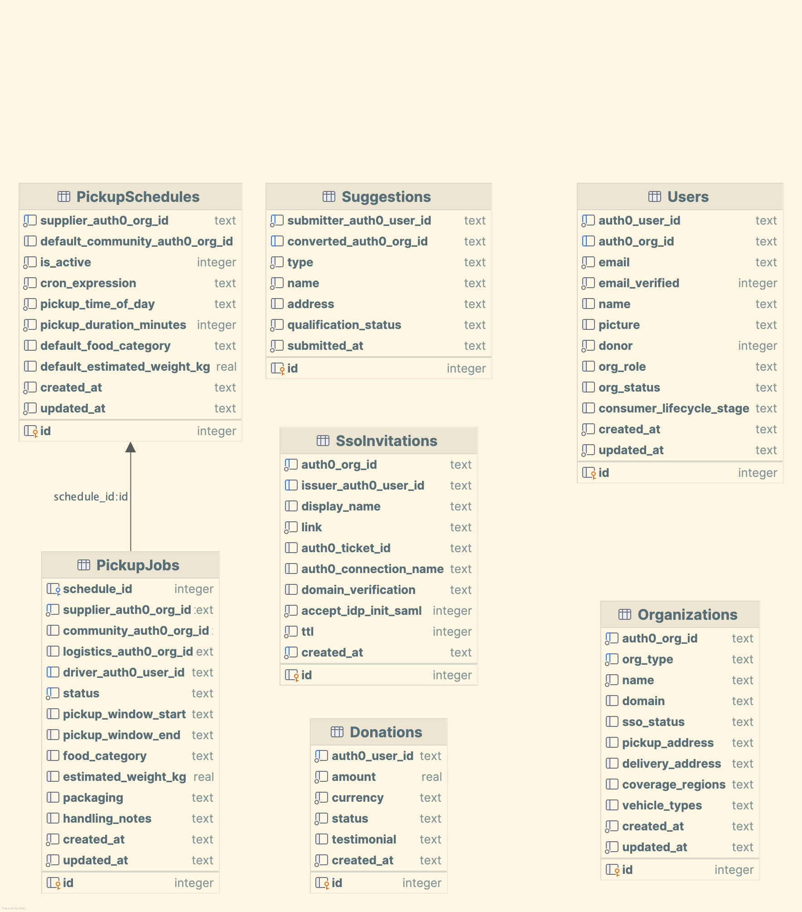
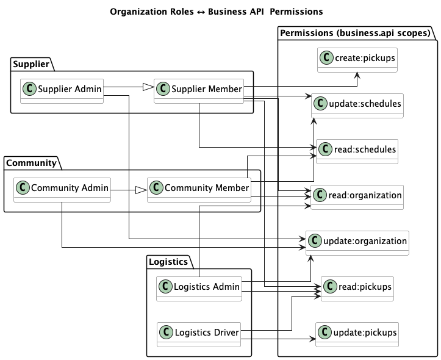

---
title: "Replate"
author: "Okta"
subject: "Markdown"
keywords: [ Auth0, B2B, B2C, B2A, SaaS ]
subtitle: "A hypothetical start-up demonstrating Auth0"
lang: "en"
toc: true
numbersections: true
titlepage: true,
titlepage-text-color: "FFFFFF"
titlepage-rule-color: "360049"
titlepage-rule-height: 0
titlepage-background: "./diagrams/okta-background-a4.jpg"
...

# Replate

Replate is a hypothetical start-up demonstrating Auth0’s B2C, B2B/Organizations, SaaS, and AI capabilities. This repo
provides reusable assets and patterns to show how Auth0 integrates with Cloudflare Workers and related services. Some
features are intentionally stubbed for clarity; the repo is an informative demo rather than a fully functional product.

# Business Case

Replate aims to use technology to reduce food waste.

Replate connects three groups of entities within its platform:

- **Suppliers** are business locations that occasionally have an oversupply of food, such as restaurants, venues,
  bakeries, and grocery stores.
- **Communities** are locations where food can be shipped to consume or redistribute among those in need. Think of
  shelters, charities, aged care centres, and humanitarian organisations.
- **Logistics** are transport companies that have spare capacity to transport food from suppliers to communities.



Replate allows suppliers to inform that they have an oversupply of food. Suppliers can do this by raising an ad-hoc
request or scheduling a cadence for food collection. Think of Replate as Uber for food.

Replate then reviews communities that signed up for food and allocates any available capacity from logistics companies
to pick up and deliver the food supply to those in need. Replate schedules the transport and informs suppliers,
community managers, and transport drivers of the next steps.

Alongside business use cases, Replate has a consumer-facing side that allows people to support the initiative by
donating money and suggesting businesses that Replate can connect to.

# Platform and Integration

We have a high-level working prototype that's built on top of the following integrations:

- Websites, including static `www.` websites and three SPA websites are all hosted on Cloudflare workers.
    - `donor.`: for consumer users (aka donors)
    - `business.`: for businesses users
    - `admin.`: for replate admin users
- Auth0 for CIAM
- Cloudflare D1 for our core operational database and CRM
- Terraform for platform provisioning
- [ReactAdmin](https://marmelab.com/react-admin/) is a front-end SPA technology for business website `business.`
- Client side React is a front-end SPA technology for consumer website `donor.`
- The static website is using plain HTML/CSS
- Okta is the Workforce identity for Replate employees - It's added an organization & connection in Auth0 with Terraform
- API is built with [Hono](https://hono.dev) and TypeScript
- Mailtrap as an SMTP server for email communications
- Makefile, npm and wrangler for executing build and deployment

# Project Folder Structure

- **tf/** Terraform scripts to provision project in Cloudflare, Auth0 and other platforms
- **websites/** static website contents
    - **websites/replate.dev** static website for www.replate.dev
    - **websites/reuse.dev** static website for www.reuse.dev
- **admin/** Replate administration application and API
    - **admin/spa** single page application (SPA) for replate users. Only members of Replate Organization can log in to
      this website
    - **admin/api** APIs that power admin app
- **donor/** Consumer application and API
    - **donor/spa** single page application (SPA) for donors
    - **donor/api** APIs that power donor app
- **business/** Business application and API
    - **business/spa** single page application (SPA) for business users
    - **business/api** APIs that power business app
- **crm/** Data model SQL files and scripts
- **auth0/** Auth0 configuration and supporting assets
    - **auth0/actions** Actions source code
    - **auth0/api** contains API exposed to Auth0 for Event streaming and Actions
- **native/** native apps
    - **native/ios** native app for iOS in Swift/Auth0
    - **native/android** native app for Android in Kotlin/Auth0

The source code is managed as a monorepo. Each subproject (`app/`, `donor/`, `api/`) has its own `package.json`.

When code assets rely on a `.env` file for configuration, a template file named `.env.example` exists in each project's
root. Terraform populates `.env` files with operational configuration such as `AUTH0_CLIENT_ID` and `CALLBACK_URL`.

All apis are with Hono SDK, accept Auth0 issued access_token and deployed on top of Cloudflare ESM worker.

App SPA apps are using React v19 (client side mode) and Auth0 React SDK v2.4. SPA apps use browser's native fetch to
make API calls.

# Quickstart for Code Generators

- Read config from the following files (do not hardcode):
    - donor SPA: donor/spa/public/auth_config.json
    - business SPA: business/spa/public/auth_config.json
    - admin SPA: admin/spa/public/auth_config.json
- API contracts:
    - donor/api/spec/openapi.yaml
    - business/api/spec/openapi.yaml
    - admin/api/spec/openapi.yaml
- API code:
    - donor/api/src
    - business/src
    - admin/api/src
- Where to place routes and bundles:
    - SPAs live under donor/spa, business/spa, admin/spa (React single-page bundles)
    - API workers live under donor/api, business/api, admin/api (Hono + Cloudflare Workers)
- Auth initialization: fetch /auth_config.json at startup; use PKCE flows; attach Bearer tokens as specified
- Cloudflare SPA routing: set not_found_handling = "single-page-application" in each wrangler.toml

# Domain names

The following are business subdomains under top-level domain name `replate.dev`:



- **`www`** static website with a landing page showing a picture of a donation and a counter of how many plates of food
  are saved. On the top right side of the website, there is a Login button. When clicked, the Login button shows a
  dropdown to log in to Consumer App or Business App.
    - If the user is already logged in (detected by Auth0 SDK), the top right of the website shows a button to go to the
      app and log out.
- **`donor`** SPA app and API that is for consumer persona (Donor)
- **`business`** SPA app and API that is for business user personas (see Actors section for details)
- **`admin`** SPA app and API that is for Replate's own admin workforce personas (see Actors section for details)
- **`id`** Auth0-managed custom domain name pointing to production tenant `replate-prd.au.auth0.com`.

All subdomains are powered by Cloudflare ESM workers and Cloudflare DNS. SPA sites use workers with assets and
`not_found_handling = "single-page-application"` flag.

# Actors and Use-cases

## Donor

Donor is a normal consumer user who can sign up and log in to `donor` website.

As a donor, a user can:

1. **Sign up** with their email. Auth0 verifies their email during sign-up by sending an OTP
2. **Login** to donor website
3. Once logged in, they can **donate money** via a form. Money raised is used to support the operations of Replate
4. See **history** of their donations; indicating date and amount. This is for tax purposes.
5. **Suggest** new supplier or communities.
6. Donors can sign up & log in with their **social account** (Google, Facebook, Apple) as well as credentials.

## Replate Admin

Replate Admin is a member of the Replate workforce who can run business operations in the app.

Use cases:

1. **Invite** an organization for self-service SSO; Admin does this by calling Auth0 API for self-service SSO.
2. See the **status of invitations**
3. See a list of suppliers, community, or logistics organisations. These are modelled as organisations in Auth0 and
   fetched by calling the Auth0 management API.

## Business Use Cases



Note: Admin personas inherit the capabilities of their corresponding Member personas (e.g., Supplier Admin inherits
Supplier Member; Community Admin inherits Community Member).

### Supplier Admin

Supplier Admin is a member of the supplier organisation in Auth0.

1. **log in** to business website.
2. **Accepts self-service SSO invitation** from Replate Admin and completes the self-service setup against their
   workforce IDP.
3. **Update the address** of the supplier's pick-up location

### Supplier Member

Supplier Member is a member of a supplier organisation in Auth0.

1. Can **log in** to the business website with the SSO that their admin has set up. SSO is powered with HRD (Home Realm
   Discovery), such as when email is matched for the company domain, like `member@supplier.com`, the user is redirected
   to the supplier's IdP at `idp.supplier.com`
2. Can **view and update pick-up schedule**.
3. Can **request ad-hoc pick up**.
4. Can **view the list of pickup jobs** for their organization (GET /jobs).

### Logistics Admin

Logistics Admin is a member of the logistics organisation in Auth0

1. **Accepts self-service SSO invitation** from Replate Admin and completes the self-service setup against their
   workforce IDP.
2. **Update the details** of the logistics company.

### Driver

Driver is a member of the logistics organisation in Auth0

1. Can **log in** to business website with the SSO that their admin has set up. SSO is powered by HRD.
2. Can **view the list of deliveries** assigned to them and their pickup location and address.
3. Mark delivery **in progress**.
4. Mark delivery as **completed**.

### Community Admin

Community Admin is a member of a community organisation in Auth0

1. Can **log in** to business website.
2. **Accepts self-service SSO invitation** from Replate Admin and completes the self-service setup against their
   workforce IDP.
3. **Update the address** of the community's delivery location

### Community Member

Community Member is a member of a community organisation in Auth0

1. Can **log in** to the business website with the SSO that their admin has set up. SSO is powered with HRD.
2. Can **view and update the delivery schedule**.

# Core Data Model in CRM

The API layer doesn't have a DB layer on its own. Two sources of backend for the API are:

1. Auth0 CIAM data is accessed with the Auth0 management API. To access data, the API layer has a confidential M2M
   client with the Auth0 management API granted and occasionally performs a client credentials grant to obtain a valid
   access token to call the management API.
2. Cloudflare D1 relational database. Contains a mirror of users and organizations from Auth0 as well as other
   operational tables like Pickups, Suggestions, Donation.



## 1) `Users` Table

Every person who logs into Replate is a user. This table stores all users, regardless of whether they are a business
user or a consumer.

Data is federated between Auth0 and D1. The API layer is responsible for combining this data when needed. The Auth0
`user_id` is the primary key in Auth0, and in D1, the AUTOINCREMENT User `id` is the primary key.

The link between an Auth0 user and an D1 record is bidirectional. In the Auth0 user profile, `app_metadata.user_id`
points to their D1 User ID. Auth0's `user_id` is stored in a custom `auth0_user_id` field in the D1 record.

An Auth0 Post-User-Registration Action ensures all users have a corresponding record in D1. If the
`app_metadata.user_id` field is missing, the Action calls `api.id.` API to create a record in the `User` table and
stores the resulting Record ID in the user's `app_metadata`.

- **Primary Key**: `id` (INTEGER PRIMARY KEY AUTOINCREMENT)
- **Fields**:
    - `auth0_user_id` (Text, Unique)
    - `auth0_org_id` (Text, nullable; Auth0 Organization ID if the user is a business user)
    - `email` (Text, required)
    - `email_verified` (Boolean: 0=false, 1=true)
    - `name`, `picture` (synced from Auth0)
    - `donor` (Boolean)
    - `org_role` (Single Select: `admin`, `member`, `driver`; nullable for donors)
    - `org_status` (Single Select: `invited`, `active`, `suspended`)
    - `consumer_lifecycle_stage` (Single Select: `visitor`, `registered`, `donor_first_time`, `donor_repeat`,
      `advocate`; default `registered`)
    - `created_at`, `updated_at` (Timestamps; `updated_at` maintained by trigger)
- **Associations**:
    - Linked to one record in the `Organizations` table (for business users) via `auth0_org_id`.

## 2) `Organizations` Table

Represents a Supplier, Community, or Logistics organization.

Businesses are stored as organizations in Auth0. We use Auth0 Event Streams to sync organizations from Auth0 into
records in this table. The organization domain stored here is the same domain used for email-based HRD federation.

- **Primary Key**: `id` (INTEGER PRIMARY KEY AUTOINCREMENT)
- **Fields**:
    - `auth0_org_id` (Text, Unique, required)
    - `org_type` (Text; one of `supplier`, `community`, `logistics`)
    - `name` (Text, required)
    - `domain` (Text; single domain used for HRD; optional)
    - `sso_status` (Text; one of `not_started`, `invited`, `configured`, `active`; default `not_started`)
    - `pickup_address` (Text, for Suppliers)
    - `delivery_address` (Text, for Communities)
    - `coverage_regions` (Long Text, for Logistics)
    - `vehicle_types` (Text; JSON array string, e.g., `["van", "truck"]`, for Logistics)
    - `created_at`, `updated_at` (Timestamps; `updated_at` maintained by trigger)
- **Associations**:
    - Linked to many records in the `Users` table (the members of the organization).

## 3) `Donations` Table

Tracks all monetary donations from consumer users (Donors).

- **Primary Key**: `id` (INTEGER PRIMARY KEY AUTOINCREMENT)
- **Fields**:
    - `auth0_user_id` (Text, required)
    - `amount` (Number; stored as REAL), `currency` (Text), `status` (Text; one of `pending`, `succeeded`, `failed`)
    - `testimonial` (Long Text)
    - `created_at` (Timestamp)
- **Associations**:
    - Linked to one User via `auth0_user_id`.

## 4) `PickupSchedules` Table

This table defines the recurring pickup arrangements (i.e., "standing orders"). It acts as a template for creating
individual PickupJob records.

- **Primary Key**: `id` (INTEGER PRIMARY KEY AUTOINCREMENT)
- **Fields:**
    - `supplier_auth0_org_id` (Text, required)
    - `default_community_auth0_org_id` (Text, optional)
    - `is_active` (Boolean; 1=true, 0=false; default 1)
    - `cron_expression` (Text; e.g., `0 19 * * 1-5` for 7 PM on weekdays)
    - `pickup_time_of_day` (Time; format `HH:MM:SS`)
    - `pickup_duration_minutes` (Integer)
    - `default_food_category` (Text; JSON array string)
    - `default_estimated_weight_kg` (Number; REAL)
    - `created_at`, `updated_at` (Timestamps; `updated_at` maintained by trigger)
- **Associations**:
    - Linked to one supplier organization via `supplier_auth0_org_id`.
    - Has a one-to-many relationship with the `PickupJobs` table.

## 5) `PickupJobs` Table

This table tracks the lifecycle of a single, concrete pickup event, whether it was generated from a schedule or created
as an ad-hoc request.

- **Primary Key**: `id` (INTEGER PRIMARY KEY AUTOINCREMENT)
- **Fields:**
    - `schedule_id` (Integer; FK to PickupSchedules.id, nullable; if NULL, this is an ad-hoc request)
    - `supplier_auth0_org_id` (Text, required)
    - `community_auth0_org_id` (Text, optional)
    - `logistics_auth0_org_id` (Text, optional)
    - `driver_auth0_user_id` (Text, optional)
    - `status` (Text; default `New`; one of `New`, `Triage`, `Logistics Assigned`, `In Transit`, `Delivered`,
      `Canceled`)
    - `pickup_window_start` (Timestamp, ISO 8601)
    - `pickup_window_end` (Timestamp, ISO 8601)
    - `food_category` (Text)
    - `estimated_weight_kg` (Number; REAL)
    - `packaging` (Long Text)
    - `handling_notes` (Long Text)
    - `created_at`, `updated_at` (Timestamps; `updated_at` maintained by trigger)
- **Associations**:
    - Linked to one record in Organizations via `supplier_auth0_org_id` (the Supplier).
    - Linked to one record in Organizations via `community_auth0_org_id` (the destination Community).
    - Linked to one record in Organizations via `logistics_auth0_org_id` (the assigned Logistics partner).
    - Linked to one record in Users via `driver_auth0_user_id` (the assigned Driver).
    - (Optionally) Linked to one record in PickupSchedules via `schedule_id`.

## 6) `Suggestions` Table

Captures new leads for potential partners, submitted by consumers.

- **Primary Key**: `id` (INTEGER PRIMARY KEY AUTOINCREMENT)
- **Fields**:
    - `submitter_auth0_user_id` (Text, required)
    - `converted_auth0_org_id` (Text, optional)
    - `type` (Text; one of `supplier`, `community`, `logistics`)
    - `name` (Text)
    - `address` (Text)
    - `qualification_status` (Text; default `New`; one of `New`, `Contacted`, `Qualified`, `Rejected`)
    - `submitted_at` (Timestamp)
- **Associations**:
    - Linked to one record in `Users` via `submitter_auth0_user_id` (the Submitter).
    - (Optionally) Linked to one record in `Organizations` via `converted_auth0_org_id` once the suggestion is converted
      into a partner.

## 7) `SsoInvitations` Table

Captures self-service SSO Invitations for an organization

- **Primary Key**: `id` (INTEGER PRIMARY KEY AUTOINCREMENT)
- **Fields**:
    - `auth0_org_id` (Text, required)
    - `issuer_auth0_user_id` (Text, optional)
    - `display_name` (Text)
    - `link` (Text, required)
    - `auth0_ticket_id` (Text)
    - `auth0_connection_name` (Text)
    - `domain_verification` (Text; one of `Off`, `Optional`, `Required`)
    - `accept_idp_init_saml` (Boolean; default 0=false)
    - `ttl` (Integer; time to live in seconds from creation; default 432000)
    - `created_at` (Timestamp)
- **Associations**:
    - Linked to one record in `Organizations` via `auth0_org_id` (the organization this invitation is issued for).
    - Linked to one record in `Users` via `issuer_auth0_user_id` (Admin user who issued invitation link).

# API Contract

The API follows the OpenAPI 3.1 specification. securitySchemes is OAuth2 with authorizationCode as only supported flow.
Endpoints are according to Auth0 endpoints.

## Consumer API

The full contract is defined in `consumer/api/spec/openapi.yaml`. All development must adhere to this contract.

- **`GET /donations`**: Retrieves the donation history for the logged-in user.
    - **Permissions**: Authenticated user with a valid access_token.
    - **Implementation**: Reads records from the `Donation` table, filtering by the User record associated with the
      caller's `auth0_user_id`.
- **`POST /donations/create-payment-intent`**: Creates a Payment Intent.
    - **Request Body**: `{ "amount": 50.00 }` (in dollars)
    - **Implementation**: Creates a new record in the `Donation` table and returns its ID.
    - **Permissions**: Authenticated user with a valid access_token.
- **`POST /suggestions`**: Submits a suggestion for a new supplier/community.
    - **Request Body**: `{ "type": "supplier", "name": "Local Bakery", "address": "456 Oak Ave" }`
    - **Permissions**: Authenticated user with a valid access_token.
    - **Implementation**: Creates a new record in the `Suggestion` table and returns its ID.

## Business API

The full contract is defined in `business/api/spec/openapi.yaml`. All development must adhere to this contract. API's
base path is `/api/`



- **`GET /organizations/{orgId}`**: Retrieves details for a specific organization.
    - **Permissions**: Requires a token with `read:organization` permission. User must be a member of `{orgId}`.
- **`PATCH /organizations/{orgId}`**: Updates organization details (e.g., address).
    - **Request Body**: `{ "metadata": { "delivery_address": "123 Main St" } }`
    - **Permissions**: Requires a token with `update:organization` permission. User must be an 'Admin' of `{orgId}`.
- **`GET /jobs`**: Fetches a list of pickup jobs for the user's organization.
    - **Permissions**: Requires a token with `read:pickups` permission.
    - **Implementation**: Lists records from the PickupJob table, filtering by the Organization record associated with
      the
      caller’s auth0_org_id claim.
- **`POST /jobs`**: Creates a new ad-hoc pickup job.
    - **Permissions**: Requires a token with `create:pickups` permission.
    - **Implementation**: Creates a new record in the PickupJob table with a NULL schedule_id; links the Supplier
      organization from the caller’s org.
- **`PATCH /jobs/{id}`**: marks a job as in-progress or completed.
    - **Permissions**: transitions restricted by permission `update:pickups`
- **`GET /schedules`**: Fetches the pickup schedules for the user's organization.
    - **Permissions**: Requires a token with `read:schedules` permission.
    - **Implementation**: Lists records from the PickupSchedule table, filtering by the Organization record associated
      with
      the caller's auth0_org_id.
- **`POST /schedules`**: Creates a new recurring pickup schedule.
    - **Permissions**: Requires a token with `update:schedules` permission.
- **`PATCH /schedules/{scheduleId}`**: Updates an existing pickup schedule.
    - **Permissions**: Requires a token with `update:schedules` permission.
- **`GET /delivery-schedules`**: Get list of delivery schedules for this community
- **`PATCH /delivery-schedules/{id}`**: update delivery schedules for this community

## Admin API

The full contract is defined in `admin/api/spec/openapi.yaml`. All development must adhere to this contract. API's base
path is `/api/`

These endpoints support workforce Admin operations described earlier (inviting organizations for self‑service SSO,
checking invitation status, and listing organizations). Admin API runs as a Cloudflare Worker using Hono and typically
calls Cloudflare D1 for CRM and Auth0 Management API.

Admin API is backed by two systems:

1. Cloudflare D1 database. Use Cloudflare database binding to query and update data. Primary source of truth.
2. Auth0 management API.

- **`POST /organizations/{orgId}/sso-invitations`**: Initiates a self-service SSO invitation for a business
  organization (supplier, community, or logistics).
    - Request Body: `{ "accept_idp_init_saml": true|false, "ttl": 4800, "domain_verification": true|false }`
    - Implementation:
        - Finds the organization in Organizations table (via Management API), setting display name and domain used for
          HRD.
        - Calls Auth0 management API to create self-service SSO invitation link
        - Creates an invitation row in SelfServiceSSOInvitations table. `link` and `auth0_link_id` are from the Auth0
          management API call response.
        - updates the Organization record in D1 with. sets `sso_status` to `invited`.
    - Permissions: Requires an admin workforce token with permission `create:sso_invitations`.
    - Response: `{ "invitation_id": "inv_123", "auth0_org_id": "org_abc123", "link": "https://invitation-link" }`

- **`GET /organizations/{orgId}/sso-invitations`**: Lists invitations for the organization and their current statuses.
    - Implementation: Reads invitation from D1 SsoInvitations table and computed `sso_status`. sso_status is **expired**
      if current time is after `created_at` + `ttl`.
    - Permissions: Requires `read:sso_invitations`.
    - Response:
      `[{ "invitation_id": "inv_123", "org_id": "org_abc123", "link": "link", "sso_status": "expired", "created_at": "2025-09-01T10:00:00Z" }]`

- **`DELETE /organizations/{orgId}/sso-invitations/{invtId}`**: Deletes an invitation and revokes it from Auth0
    - Permissions: Requires `delete:sso_invitations`.
    - Implementation: finds record in SelfServiceSSOInvitations and revokes Auth0 invitation.
    - Response: `{ "archived": true }`

- **`GET /organizations`**: Lists organizations known to Replate.
    - Query Params: `org_type`, `sso_status`, `q`.
    - Implementation: Reads from D1 `Organization` table. Supports pagination.
    - Permissions: Requires `read:organizations`.
    - Response:
      `[{ "auth0_org_id": "org_abc123", "name": "Acme Bakery", "org_type": "supplier", "domain": "acme.com", "sso_status": "configured" }]`

- **`GET /organizations/{orgId}`**: Retrieves details for a specific organization, including SSO setup status.
    - Implementation: Reads from D1 `Organization` table.
    - Permissions: Requires `read:organizations`.

- **`PATCH /organizations/{orgId}`**: Updates organization details/metadata managed by Replate (not identity-provider
  credentials).
    - Request Body (example):
      `{ "name": "Acme Bakery", "domain": "acme.com", "metadata": { "org_type": "supplier", "pickup_address": "12 King St", "delivery_address": "", "coverage_regions": "", "vehicle_types": ["van"] } }`
    - Implementation: Updates D1 Organization fields; Updates Auth0 org name/domain via Management API where supported;
      may update computed `sso_status`.
    - Permissions: Requires `update:organizations`.

- **`POST /organizations`**: Creates a new organization record in Auth0 and in D1 (without sending an invitation).
    - Request Body: `{ "name": "Beta Logistics", "org_type": "logistics", "domain": "betalogs.io" }`
    - Permissions: `create:organizations`.
    - Response: `{ "auth0_org_id": "org_DEF456" }`

- **`DELETE /organizations/{orgId}`**: Archives an organization in Replate;
    - Implementation: marks rows as deleted in D1 `Organization` tables (soft delete). Deletes Auth0 org remains.
    - Permissions: `update:organizations`.
    - Response: `{ "archived": true }`

- **`GET /users`**: List users with optional filters and pagination.
    - Query Params: `q` (search email/name), `org_id` (filter by organization's Auth0 ID), `page`, `per_page`.
    - Implementation: Joins D1 `Users` with `Organizations` to include `org_id` and `org_name`.
    - Permissions: Requires `read:users`.
    - Response:
      `[{ "id": 12, "auth0_user_id": "auth0|abc", "email": "admin@replate.dev", "email_verified": true, "name": "Admin", "donor": false, "org_role": "admin", "org_status": "active", "consumer_lifecycle_stage": "registered", "org_id": "org_abc123", "org_name": "Acme" }]`
- **`GET /users/{id}`**: Retrieve a user by D1 `id`.
    - Permissions: `read:users`.
    - Response:
      `{ "id": 12, "auth0_user_id": "auth0|abc", "email": "...", "org_id": "org_abc123", "org_name": "Acme", ... }`
- **`PATCH /users/{id}`**: Update user attributes managed by Replate.
    - Request Body (partial fields allowed):
      `{ "name": "New Name", "email_verified": true, "donor": false, "org_role": "member", "org_status": "active", "consumer_lifecycle_stage": "registered", "org_id": "org_abc123" }`
    - Implementation: Updates columns in D1 `Users` and reassigns `organization_id` if `org_id` corresponds to an
      existing organization.
    - Permissions: Requires `update:users`.

Notes and Constraints:

- Authentication: Only workforce Admins (Okta-managed) obtain tokens to call Admin API. Tokens include appropriate
  scopes noted above.
- SSO invitation flows vary by IdP; this API focuses on orchestrating Auth0 Organization Invitations and capturing
  status (`not_started`, `invited`, `configured`, `active`).
- Data consistency: D1 is a source of truth for reporting and enrichment; calls Auth0 management API to perform
  selective number of operations such as sending a self-service SSO invitation.
- Errors: Return 400 for validation errors (e.g., invalid domain), 404 for unknown orgId, 409 for duplicate domain, 502
  if Auth0 Management API is unavailable.
- Admin API has a confidential Auth0 client (client_id and client_secret)
  with [Auth0's Node.js SDK](https://www.npmjs.com/package/auth0) for Management API version 4.29.

# Website Details

This section describes how each website is built and how it should look and behave so an implementation (or code
generator) can create working SPAs that integrate with Auth0 and our APIs on Cloudflare Workers.

- Hosting: All sites are hosted on Cloudflare Workers with static assets on Workers Sites. SPA routing uses
  not_found_handling = "single-page-application" in wrangler.toml.
- Frameworks: Donor uses client-side React (simple SPA) or vanilla DOM where noted; Business and Admin use React. Admin
  uses ReactAdmin.
- State: Lightweight state via React Context + hooks; URL state in query strings where useful. No Redux required.
- Styling: CSS variables and utility classes. Dark-mode-aware. Accessible (WCAG AA), responsive. Fonts: Inter (fallback
  system fonts).
- Auth: Auth0 SPA SDK @auth0/auth0-spa-js for Donor and Business. Admin uses Auth0/OIDC. All SPAs use PKCE. 
- Environments: Configuration via env-specific auth_config.json and .env populated by Terraform.
- APIs: Hono workers per domain, CORS restricted, bearer verification.

Folder hints (existing and to be generated by an implementation):

- websites/replate.dev: Static marketing site for www.replate.dev.
- donor/spa: Donor SPA static bundle (already present: public/index.html, js/app.js, js/ui.js, css/main.css,
  auth_config.json)
- business/spa: Business SPA static bundle (to be generated using this spec)
- admin/spa: Admin SPA static bundle (ReactAdmin) (to be generated using this spec)

## Common Auth0 configuration

- Auth0 domain: `id.replate.dev` (custom domain proxied to Auth0 tenant)
- Donor Application (SPA):
    - client_id: AUTH0_CLIENT_ID_DONOR
    - audience: `donor.api`
    - scope: openid profile email
    - Allowed callback URLs: https://donor.replate.dev/
    - Allowed logout URLs: https://donor.replate.dev/
- Business Application (SPA with Organizations):
    - client_id: AUTH0_CLIENT_ID_BUSINESS
    - audience: `business.api`
    - scope: openid profile email 
    - permissions: read:organization update:organization read:pickups create:pickups read:schedules update:schedules
    - Allowed callback URLs: https://business.replate.dev/
    - Allowed logout URLs: https://business.replate.dev/
    - Organizations: enabled; prompt=login or organization hint supported; org_id claim expected.
- Admin Application (SPA/Console):
    - client_id: AUTH0_CLIENT_ID_ADMIN
    - audience: `admin.api`
    - scope: openid profile email 
    - permissions: read:organizations update:organizations create:organizations read:sso_invitations create:sso_invitations delete:sso_invitations
    - Token type: 30-minute lifetime
    - Allowed callback URLs: https://admin.replate.dev/
    - Allowed logout URLs: https://admin.replate.dev/

## Auth SDK usage patterns

- Initialize Auth0 client at app start reading `config.json` containing `domain`, `clientId`, `audience`.
- Use `loginWithRedirect()` with appState.returnTo to preserve route on login.
- Post-login callback route at /callback exchanges code for tokens and redirects to appState.returnTo or "/".
- Attach Authorization: Bearer <access_token> to API calls.
- Logout uses returnTo homepage.
- Token claims relied upon:
    - `sub` (Auth0 user id)
    - `org_id` (for Business; may be null for Donor)
    - `permissions` (string array)

## Routing Conventions

- Single-page routing using History API.
- Donor routes: /, /donate, /history, /suggest, /callback, /logout
- Business routes: /, /jobs, /jobs/new, /schedules, /schedules/new, /organization, /callback, /logout
- Admin routes: /, /organizations, /organizations/:id, /invitations, /callback, /logout

Look & Feel (shared)

- Header: left logo, center section-specific title, right auth button (Login/Logout and Profile avatar).
- Colors: primary #2E7D32 (green), secondary #1565C0 (blue), accent #FFB300 (amber), neutral grays. Respect
  prefers-color-scheme.
- Buttons: rounded 6px, hover transitions, focus outlines 2px.
- Cards: subtle shadow for content blocks, max-width 1200px content.
- Forms: labeled inputs, inline validation messages, large touch targets.

## Donor SPA (`donor.replate.dev`)

- Technology: Vanilla JS + @auth0/auth0-spa-js + Fetch; built as static assets served by Cloudflare Worker.
- Purpose: Allow consumers to authenticate and donate, view history, and submit suggestions.
- Pages/Components:
    - HomePage: hero image, counter of plates saved (from a public stats endpoint or mocked), CTA buttons "Donate" and "
      Suggest a Partner".
    - DonatePage: form with amount (number, min 1.00, step 0.5), currency (USD by default), optional testimonial. On
      submit, POST /donations/create-payment-intent then show confirmation.
    - HistoryPage: list of past donations (GET /donations), with date, amount, status.
    - SuggestPage: form to submit suggestion (type select: supplier/community/logistics; name; address) -> POST
      /suggestions.
    - CallbackPage: handles Auth0 code exchange and redirects.
    - NavBar, Footer, ProtectedRoute wrapper.
- Auth rules:
    - Audience `donor.api`
    - Silent token refresh
- API integration:
    - `GET /donations`
    - `POST /donations/create-payment-intent { amount }`
    - `POST /suggestions { type, name, address }`
    - All with Authorization header using access_token.
- Example config file (donor/spa/public/auth_config.json):

```json
{
  "domain": "id.replate.dev",
  "clientId": "AUTH0_CLIENT_ID_DONOR",
  "audience": "donor.api",
  "redirectUri": "https://donor.replate.dev/callback"
}
```

- Build/Deploy: npm run build produces static assets; wrangler.toml uses not_found_handling = "single-page-application";
  Makefile target deploy.

## Business SPA (`business.replate.dev`)

- Technology: React 19 + @auth0/auth0-react + React Router + Fetch; optional UI kit (MUI or lightweight CSS).
- Personas: Supplier Admin/Member, Logistics Admin/Driver, Community Admin/Member.
- Auth rules:
    - Audience `business.api`
    - org_id must be present; enforce membership and role via claims and scopes.
- Pages/Features:
    - Dashboard: summary of active jobs, schedules.
    - JobsList: GET /jobs filtered by org_id and role; Driver sees "My Jobs" with status updates (PATCH job status
      endpoints may exist later).
    - JobNew: POST /jobs to create ad-hoc job (Supplier role only: admin/member).
    - SchedulesList: GET /schedules; Admin and Supplier Member can create/update pickup schedules (POST /schedules,
      PATCH /schedules/{id}).
    - ScheduleNew/Edit: POST /schedules and PATCH /schedules/{id}.
    - OrganizationDetails: GET /organizations/{orgId} and PATCH for admins to update metadata (addresses, etc.).
    - CallbackPage, ProtectedRoute, OrgSwitcher (optional if user is in multiple orgs; pass organization hint).
- API integration: attach bearer token; handle 401/403 by redirecting to log in; show scope errors.
- Routing: /, /jobs, /jobs/new, /schedules, /schedules/new, /organization, /callback.
- Config file example (business/spa/public/auth_config.json):
  { "domain": "id.replate.dev", "clientId": "AUTH0_CLIENT_ID_BUSINESS", "audience": "business.api", "
  redirectUri": "https://business.replate.dev/callback", "useOrganizations": true }

## Admin SPA (`admin.replate.dev`)

- Technology: React 18 + ReactAdmin + @auth0/auth0-spa-js (or OIDC lib); custom RA authProvider and dataProvider.
- Auth rules:
    - Audience `admin.api`
    - Scopes: read:organizations, update:organizations, create:organizations, read:sso_invitations, create:
      sso_invitations, delete:sso_invitations.
- Resources (ReactAdmin):
    - organizations: list, show, edit, create.
    - invitations: list, create.
- Screens:
    - OrganizationsList: table with name, org_type, domain, sso_status.
    - OrganizationShow: details + related metadata from D1 (addresses, schedules where relevant).
    - OrganizationEdit: edit form; PATCH /organizations/{orgId}.
    - OrganizationCreate: POST /organizations.
    - InvitationsList: GET /organizations/{orgId}/sso-invitations with filters status/org_type.
    - InvitationCreate: POST /organizations/{orgId}/sso-invitations; form fields accept_idp_init_saml, ttl,
      domain_verification.
    - InvitationDelete: DELETE /organizations/{orgId}/sso-invitations/{invtId};
- Data provider endpoints map directly to Admin API described above.
- Config example (admin/spa/public/auth_config.json):
  { "domain": "id.replate.dev", "clientId": "AUTH0_CLIENT_ID_ADMIN", "audience": "admin.api", "
  redirectUri": "https://admin.replate.dev/callback", "organization": "REPLATE_ORG_ID" }

## Accessibility & i18n

- All interactive elements keyboard accessible. Labels tied to inputs with `aria-*` where necessary.
- Color contrast >= 4.5:1 for text.
- String resources abstracted for future i18n; default locale en-US.

## Error Handling & Loading

- Global ErrorBoundary shows friendly message and retry.
- API errors mapped: 400 validation -> inline field errors; 401 -> login; 403 -> permission message; 404 -> not found
  view; 5xx -> toast with retry.
- Skeleton loaders for lists/forms; optimistic UI for simple PATCH.

## Telemetry (optional)

- Simple pageview events via Cloudflare Analytics or a pluggable analytics.js; avoid tracking PII.

## Local Development

- Each SPA uses a static dev server or wrangler dev; set auth_config.json to point to a dev Auth0 tenant/custom domain
  and localhost callback when running locally.
- Example local redirect URIs: http://localhost:5173/callback (Vite) or http://localhost:8787/callback (wrangler dev).

## Deployment

- Use Makefile in each SPA folder to build and wrangler publish to Cloudflare.
- Static cache headers for assets; HTML not cached.

## Notes for code generators

- Prefer explicit file paths and keep edits minimal; do not introduce new frameworks.
- Follow the API contracts in donor/api/openapi.yaml, business/api/openapi.yaml, admin/api/openapi.yaml when
  implementing endpoints or clients.
- Externalize configuration via public/auth_config.json and .env; never hardcode secrets or client IDs.
- For SPA routing, ensure not_found_handling = "single-page-application" in wrangler.toml.
- Use Hono for Workers, React 19 for SPAs, and @auth0/auth0-react v2.4 patterns shown here.
- Generate `index.html` that loads a root React bundle, defines a #root element, and fetches `/auth_config.json` at
  startup to init Auth0.
- Implement an AuthProvider component exposing isAuthenticated, user, login, logout, getAccessTokenSilently.
- Implement ProtectedRoute that waits for Auth0 to initialize and then either renders children or triggers
  loginWithRedirect.
- Keep configuration externalized in `public/auth_config.json`; do not hardcode client IDs or domain names.

# Authorization Model

## Claims and Permissions Checklist (for code generators)

- Donor SPA
    - Scopes: `openid profile email`
- Business SPA
    - Audience: `business.api`
    - Required claims: `org_id` present; 
    - Permissions (as needed by pages):
      `read:organization update:organization read:pickups create:pickups read:schedules update:schedules update:pickups`
- Admin SPA
    - Audience: `admin.api`
    - Permissions:
      `read:organizations update:organizations create:organizations read:sso_invitations create:sso_invitations delete:sso_invitations`

## Replate Admin

Replate admin has strict security rules.

- Resource server is `admin.api`
- Token validity is 5 minutes

## Business

Business access_token is issued against resource server `business.api`.
This section governs how access_token issued by Auth0 is consumed by API and which claims control which API.

Sample access_token. `org_id` is nullable for donors.

```json
{
  "sub": "auth0|123",
  "permissions": ["read:organization", "update:organization", "read:pickups", "create:pickups"],
  "org_id": "org_abc123"
}
```

# Screenplays

| No | Screenplay                       | Video                            | Website  | Demo Topic                        |
|----|----------------------------------|----------------------------------|----------|-----------------------------------|
| 01 | [s-01.txt](./videos/01/s-01.txt) | [s-01.mp4](./videos/01/s-01.mp4) | Donor    | Ideation                          |
| 02 | [s-02.txt](./videos/02/s-02.txt) | [s-02.mp4](./videos/02/s-02.mp4) | Donor    | Credential login, MyAccount       |
| 03 | [s-03.txt](./videos/03/s-03.txt) | [s-03.mp4](./videos/03/s-03.mp4) | Donor    | Social login & account linking    |
| 04 | [s-04.txt](./videos/04/s-04.txt) | [s-04.mp4](./videos/04/s-04.mp4) | Business | Credential login & RBAC & Chiclet |
| 05 | [s-05.txt](./videos/05/s-05.txt) | [s-05.mp4](./videos/05/s-05.mp4) | Business | Federation and HRD                |
| 06 | [s-06.txt](./videos/06/s-06.txt) | [s-06.mp4](./videos/06/s-06.mp4) | Business | SS-SSO, Admin website             |
| 07 | [s-07.txt](./videos/07/s-07.txt) | [s-07.mp4](./videos/07/s-07.mp4) | Both     | RTL & ACL                         |
| 08 | [s-08.txt](./videos/08/s-08.txt) | [s-08.mp4](./videos/08/s-08.mp4) | Donor    | Bulk import & Forms               |
| 09 | [s-09.txt](./videos/09/s-09.txt) | [s-09.mp4](./videos/09/s-09.mp4) | Donor    | MCD                               |
| 10 | [s-10.txt](./videos/10/s-10.txt) | [s-10.mp4](./videos/10/s-10.mp4) | Donor    | User events                       |
| 11 | [s-11.txt](./videos/11/s-11.txt) | [s-11.mp4](./videos/11/s-11.mp4) | Business | Connected Account                 |
| 12 | [s-12.txt](./videos/12/s-12.txt) | [s-12.mp4](./videos/12/s-12.mp4) | Business | CIBA                              |
| 13 | [s-13.txt](./videos/13/s-13.txt) | [s-13.mp4](./videos/13/s-13.mp4) | Both     | Closing thoughts                  |
